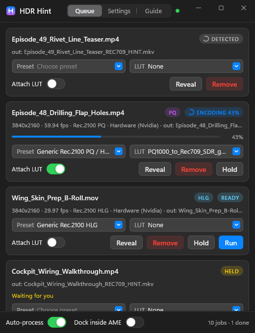
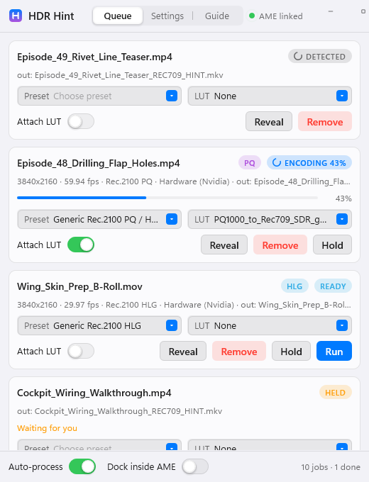
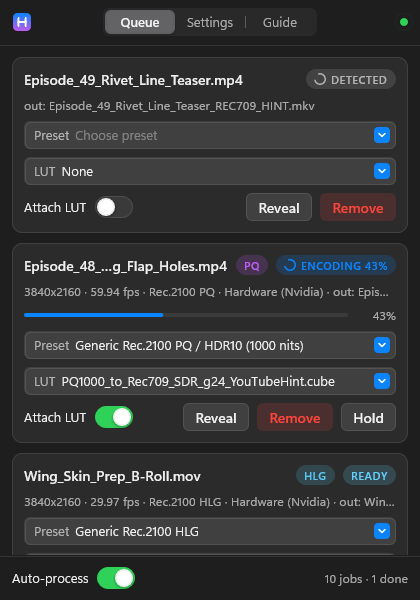
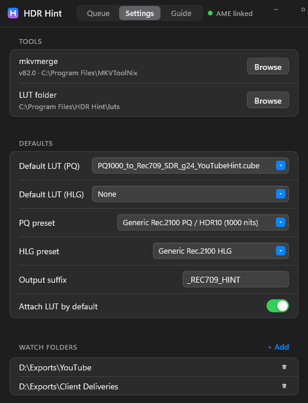
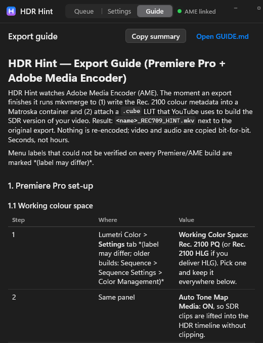

# HDR Hint

**The Adobe Media Encoder companion that finishes your HDR exports for you.**

Export from Premiere Pro or Adobe Media Encoder with hardware encoding. The moment a file
lands, HDR Hint runs mkvmerge to write the Rec. 2100 colour metadata, attaches the `.cube`
LUT YouTube uses to build the SDR version, verifies the result and moves the original to the
Recycle Bin. No re-encode. No clicking. Seconds, not hours.

<p align="center">
  
  &nbsp;&nbsp;
  
</p>

Native C++20, Windows 10/11. Custom Direct2D + DirectComposition UI (Mica, spring animations,
no UI framework). Media Encoder starts it, and it docks itself inside the AME window.

---

## Why this exists

AME's **"Include HDR10 metadata"** checkbox forces **software** encoding. On a 4K 59.94
timeline that turns a 15-minute NVENC export into hours.

So: leave the box off, keep the hardware encoder, and let HDR Hint add the equivalent metadata
at the container level afterwards. That is what YouTube reads anyway, and it takes about a
second. The attached LUT is how YouTube builds the SDR version for viewers without an HDR
display, instead of applying its own flat tone map.

## What it does

| Step | Detail |
|---|---|
| Detects the export | Three independent triggers: AME's own encoding log (`AMEEncodingLog.txt`), your render folders (AME's sidecar files appear minutes before the `.mp4`), and the CEP panel's `onItemEncodeComplete` event on hosts that run panels. |
| Waits for the file to be real | Deny-write probe, stable size, sidecars gone, MP4 box chain complete, log confirmation. AME's exclusive lock during finalize is respected, not fought. |
| Muxes | `mkvmerge` with the preset's colour flags (`--color-transfer-characteristics 16` for PQ, `18` for HLG, mastering display + MaxCLL/MaxFALL for PQ) and the `.cube` attached as `application/x-cube`. |
| Verifies | `mkvmerge -J` on the output: every colour element, track counts, the attachment's name / mime / size, duration. Only then is the file renamed. |
| Cleans up | The original goes to the **Recycle Bin**, never a permanent delete, and only if the file is unchanged since the mux. |

Per job you can change the preset, the LUT, whether to attach it, or hold the job. SDR exports
are shown and skipped. Failed exports show AME's own reason.

<p align="center">
  
  &nbsp;
  
  &nbsp;
  
</p>

## Requirements

- Windows 10 / 11. Mica needs Windows 11 22H2; older builds get a solid background.
- [MKVToolNix](https://mkvtoolnix.download/) 15 or newer (`mkvmerge.exe`, auto-detected in `Program Files`).
- Adobe Media Encoder 2019 or newer, **optional**: without it HDR Hint runs as a watch-folder tool. Developed and tested against AME 2026 (26.2.2).
- Optional: `ffprobe` on `PATH` or in `C:\ffmpeg\bin`, for colour-space detection of files that never touched AME's log.
- To build: Visual Studio 2022 (MSVC v143), CMake 3.24+, Windows SDK 10.0.22621 or newer.

## Install

```powershell
git clone https://github.com/Kemerd/hdr_hint_adobe_media_encoder.git
cd hdr_hint_adobe_media_encoder
pwsh scripts/build.ps1                      # configure, build Release, run the unit tests
```

The app is `build\Release\HdrHint.exe`. It ships its LUTs (`luts\`), the CEP panel (`cep\`)
and the guide (`GUIDE.md`) next to itself.

### Standalone: just watch folders

HDR Hint does not need Adobe software. It watches whatever folders you list and
processes any new video that appears, which is enough on its own if you export from
DaVinci, Handbrake, OBS or anything else.

```powershell
pwsh scripts/install_standalone.ps1 -WatchFolder "D:\Renders" -StartWithWindows -Launch
```

That copies the built app to `%LOCALAPPDATA%\Programs\HdrHint` (so rebuilding or moving
this repo never breaks the install), adds a Start Menu shortcut, and optionally starts it
into the tray at logon. `-Uninstall` reverses all of it. Nothing is registered as a
service and nothing is written outside your own user account.

Settings has separate switches for the two triggers, **From Media Encoder** and
**From watch folders**, so you can run either half on its own. A file seen by both is
still only processed once: every trigger resolves to the same job.

### Let Media Encoder run it

```powershell
pwsh scripts/install_startup.ps1             # AME launches HDR Hint when it starts
.\build\Release\HdrHint.exe --install-panel  # adds Window > Extensions > HDR Hint
```

The first line copies a small startup script into Media Encoder's own `Scripts\Startup`
folder. AME evaluates it at launch and starts HDR Hint into the tray; HDR Hint quits when AME
quits. **Nothing runs with Windows and nothing is installed as a service.** `-Uninstall`
reverses it. The second line registers the panel that gives you the dock target.

Then restart Media Encoder and:

1. **Window > Extensions > HDR Hint.** AME opens an empty panel and HDR Hint covers it within
   a few seconds, following it wherever it goes.
2. Drag the **HDR Hint** tab onto the top edge of the **Queue** panel. AME remembers the
   workspace, so this is a one-time move.

Docking is the default and survives AME restarts. **Dock inside AME** in the footer is the off
switch. Closing the panel floats HDR Hint into its own window and it keeps working from the
log. Running it with no panel at all is fine too: it sits in the tray and watches.

> On AME 2026, Window > Extensions opens an empty frame because Media Encoder is not a CEP
> host and never starts the panel's engine. HDR Hint covers that frame with its own window,
> which is why it looks and behaves like a native panel on every AME version.

## Export settings (the short version)

Full guide with the Premiere colour-management set-up, D-Log M options and troubleshooting:
[docs/GUIDE.md](docs/GUIDE.md), also the **Guide** tab in the app.

| Setting | Value |
|---|---|
| Format | H.265 (HEVC), Performance **Hardware Encoding** |
| Profile / Level / Tier | **Main10** / **5.2** (5.1 if hardware greys out) / **High** |
| Bitrate | VBR 1-pass, **100 Mbps** for 4K 59.94 |
| Export Color Space | **Rec. 2100 PQ**, or HLG, matching the sequence |
| Include HDR10 Metadata | **OFF** — this is the whole point; HDR Hint adds it |
| Render at Maximum Depth / Use Maximum Render Quality | ON / ON |
| Audio | AAC 320 kbps, 48 kHz |

Then upload the resulting `.mkv` to YouTube. The HDR badge and the LUT-derived SDR version
appear after processing.

## Command line

```
HdrHint.exe                                   normal start (window + tray icon)
HdrHint.exe <file.mp4> [...]                  add files by hand (drag and drop works too)
HdrHint.exe --show                            bring the running instance to the front
HdrHint.exe --tray                            start hidden in the tray
HdrHint.exe --dock | --undock                 dock onto AME, or float
HdrHint.exe --install-panel | --uninstall-panel
HdrHint.exe --process <file> [--preset id] [--lut path|none] [--suffix s]
HdrHint.exe --snap out.png                    capture the running window
HdrHint.exe --screenshot out.png [--tab 0|1|2] [--dark|--light] [--docked-look]

hdrhint_cli.exe --process <file> ...          the same headless path as a console tool
hdrhint_cli.exe --identify <file> | --presets | --mkvmerge
```

Settings live in `%APPDATA%\HdrHint\settings.ini`; logs and job history in
`%LOCALAPPDATA%\HdrHint\`.

## Presets

PQ presets write matrix 9 / range 1 / transfer 16 / primaries 9, plus MaxCLL 1000, MaxFALL 400,
Rec. 2020 mastering primaries, D65 white point and 1000 / 0.0001 cd/m² luminance. A 4000-nit
variant is included. HLG presets write transfer 18 and no mastering metadata, because HLG is
display-referred and does not need it. Add your own in `%APPDATA%\HdrHint\presets.json`.

The mastering values are written explicitly on purpose: without ST 2086 metadata, YouTube
assumes a Sony BVM-X300 reference monitor.

## Verify it without touching AME

```powershell
pwsh scripts/make_test_hdr_mp4.ps1                   # PQ / PQ+SEI / HLG / SDR clips via ffmpeg
.\build\Release\hdrhint_cli.exe --process "$env:TEMP\hdrhint_tests\test_pq_noSEI.mp4"
pwsh scripts/simulate_ame_export.ps1 -Sandbox "$env:TEMP\hdrhint_sim" `
     -Clip "$env:TEMP\hdrhint_tests\test_hlg.mp4" -ColorSpace "Rec. 2100 HLG"
```

The simulator reproduces AME's on-disk behaviour (sidecar files, the exclusive lock while the
container is assembled, the UTF-16 log block) so the whole pipeline can be exercised on any
machine, with no Adobe software installed. `-Fail`, `-Twice`, `-Truncate` and `-NoLog` cover
the unhappy paths.

## Project layout

```
src/platform/     Win32 wrappers: files, processes, pipes, registry, Recycle Bin
src/core/         engine: log tailer, folder watcher, readiness probe, mkvmerge runner, jobs, IPC
src/ui/           Direct2D toolkit (gfx, anim, theme, controls), screens, app view-models
src/ame/          AME window discovery, panel HWND locator, dock controller, panel installer
cep/              the CEP panel, and the Scripts\Startup launcher AME runs at boot
luts/             the YouTube SDR-hint LUTs shipped with the app
tests/            unit tests (ctest)
scripts/          build, per-file compile check, test clip generator, AME simulator, installers
docs/             GUIDE.md, ARCHITECTURE.md
```

[docs/ARCHITECTURE.md](docs/ARCHITECTURE.md) has the job state machine, the threading model,
the IPC protocol and the docking mechanics, including what Media Encoder actually does with
extension panels.

## Credits

Built on the shoulders of [MKVToolNix](https://mkvtoolnix.download/), used as an external tool,
and YouTube's [hdr_metadata](https://github.com/YouTubeHDR/hdr_metadata) approach to the
SDR-hint attachment. Bundles [nlohmann/json](https://github.com/nlohmann/json) (MIT), Adobe's
`CSInterface.js` and Douglas Crockford's `json2.js`. See
[THIRD_PARTY_NOTICES.md](THIRD_PARTY_NOTICES.md).

## License

[MIT](LICENSE).
